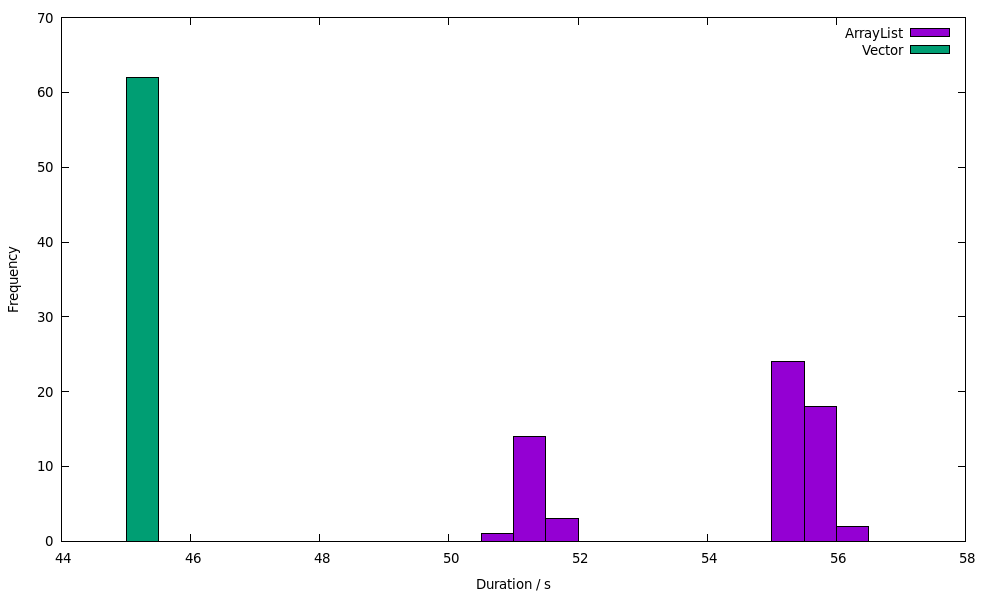

# PMD Validation Benchmark Suite

This repository contains benchmarks and analysis utilities to validate Java performance antipatterns documented in PMD (https://pmd.github.io/latest/pmd_rules_java_performance.html). Currently, only two (AvoidFileStream and OptimizableToArrayCall) contain version information. Antipatterns at code level exist since underlying implementations, either libraries or the JVM itself, are non-optimal if used in a defined way. They contain a solution which should heal the antipattern, i.e. improve the performance for any workload. By this benchmark suite, it can be checked whether antipatterns are valid for certain Java versions. If an implementation of the solution of an antipattern is slower than the antipattern itself, than this is not an antipattern. Nevertheless, it still might be valid for a specific use case. If an implementation of the solution is faster than the antipattern, the antipattern still might be wrong, since there might be a workload where the antipattern does not hold. 

## Benchmark Execution

In order to execute the benchmarks, first install the version of Java you would like to use. If you want to use a Docker image, go to benchmarks/environment/java[6,7,8,11,12] and execute ./runDocker.sh.

Afterwards, the following commands can be used to execute tests:
- cd run && ./run.sh - Execute all tests
- cd runFactorial && .. - Run analysis of factors influencing the measurement, e.g. VectorArrayListSizeBenchmark in order to test when Vector becomes slower than ArrayList

## Benchmark Analysis

The benchmarks can be analyzed by de.peass.analysis.AnalyzeFiles. This reads the all files from a given result folder, which should be passed. It returns the content of a latex-printable table.

## PeASS Validation

PeASS, an tool for measuring the performance of unit tests in different Java versions, should be able to identify performance changes at code level. Therefore, it should be able to distinguish performance of an antipattern to that of the solution. If you would like to create a project that can be used to validate PeASS, use de.peass.generation.GenerateProject.

## Interesting Potentially Invalid Patterns

There are two interesting potentially invalid patterns currently: ConsecutiveLiteralAppends and UseArrayListInsteadOfVector

### ConsecutiveLiteralAppends

In OpenJDK 11 and later, byte arrays are used to save data of a StringBuffer. When using only one append call, the System.arraycopy on the byte array is executed by calling the runtime stub jbyte_disjoint_arraycopy, which makes use of available CPU features for speeding up copying. When using multiple append calls, the used Strings in our example are so small that they are moved directly by mov-calls. In contrary, for copying the larger byte array the runtime stub is used. In theory, the usage of the runtime stub should speed up the process; using our concrete parameters, it slows down the process. On a lower level, this can be reproduced by copying bytes: Copying eleven bytes ("Hello World") from one array to another is slower than copying five bytes ("Hello"), than one byte (" ") and than five bytes ("World") to an 16 byte sized array. 

In the majority of cases, using one append is faster. Nevertheless, if the performance of append is crucial, its performance should be measured instead of blindly applying the antipatterns solution.

### UseArrayListInsteadOfVector

In order to better understand the result of UseArrayListInsteadOfVectorBenchmark, there are some factorial benchmarks in de.pmdcheck.factorial. They show, that filling a ArrayList (by calling add) is slower than filling a vector in our benchmark; retrieving elements is equally fast. When replacing the source of ArrayList, ArrayList becomes equally fast as Vector. 

The reason for this is that under certain circumstandes, after a call to System.arraycopy, creating new instances of the object which called System.arraycopy becomes slower. This can be checked by executing BenchmarkSimpleAdding: If an ExtendableIntArray is created and extended in the beginning, and then just new ExtendableIntArray-instances are created, the ops/s (on my desktop: 1196550.16 +- 109869.98) are much less than the ops/s if the other ExtendableIntArray is not created (on my desktop: 6719339.89 +- 1282763.72). If ExtendableIntArray2 is created (so an equal class, but not the same), the ops/s are equal to not creating anything before.

This also explains why the jmh benchmark becomes slower when using ArrayList: Since jmh internally stores results in an ArrayList, it triggers this slower-after-arraycopy-behaviour. 

All in all, there are only rare cases where using an ArrayList can be slower than using a Vector or other Collections. Nevertheless, this can happen in real-world examples. In order to reproduce this, there is the real-world-ish example of the monitoring framework `giegor` (seperate folder). It saves its MonitoringRecords internally in an `ArrayList`. If an `ArrayList` is created and filled before creating and saving dummy MonitoringRecords, the performance will be ~20% worse than if `Vector` is created and filled before. This can be reproduced using `run.sh` in giegor. Our measurements on OpenJDK 1.8.0_222 on Ubuntu 18.04 with i7-6700 CPU @ 3.40GHz, 16 GB RAM showed this execution durations:

This shows two things: (1) The Vector-using implementation is significantly faster. (2) The duration of Vector-using execution is slower even in the long run (one measurement takes nearly a minutes, in every VM the measurements are repeated 10 times). 

Therefore, in *some* cases, it is be faster to use Vector instead of ArrayList; nevertheless, in *most* cases, ArrayList is still faster. If you want to yield optimal performance, it will always be necessary to measure the performance if you change the source code; this can be automated using tools like [PeASS](https://github.com/DaGeRe/peass)
